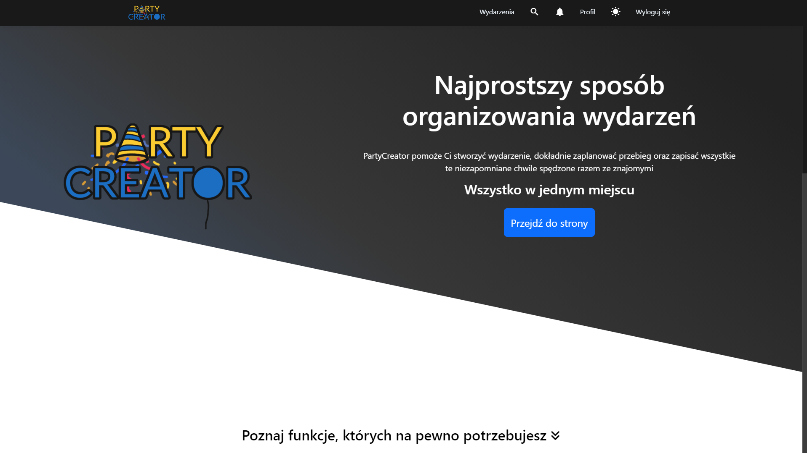

 

  <h3 align="center">PartyCreator</h3>

  

    WebAPP project for creating and managing events
     
     
    <a href="https://github.com/michalboese/PartyCreator">View Demo</a>
  

 

## Table Of Contents

* [About the Project](#about-the-project)
* [Built With](#built-with)
* [Authors](#authors)

## About The Project

PartyCreator is a web application that allows users to create, browse, and manage events. It is a comprehensive tool that facilitates the organization and participation in various types of events, from business meetings to private parties.

Key Features:

* <b>Registration and Login:</b> Users can create their account and then log in to access the full functionality of the application.
* <b>Event Creation:</b> Users can create new events, specifying their name, description, date, time, location, and other details.
* <b>Event Browsing:</b> The application enables browsing available events, both those created by the user and those to which they have been invited.
* <b>Event Management:</b> Users can manage their events by editing their details, inviting participants, monitoring the guest list, and adding additional features such as splitting the bill or creating a Spotify playlist.
* <b>Interaction with Participants:</b> The application provides tools for communication among participants through an embedded chat within events.
* <b>Adding Photos:</b> Users can add photos related to events, allowing for sharing memories and documenting the course of the meeting.
* <b>Finding and Inviting Friends:</b> Users can search for friends within the application and invite them to their events.
* <b>Notifications and Reminders:</b> The application can send notifications about upcoming events and reminders about important deadlines.
* <b>Profile Personalization:</b> Users have the option to personalize their profile by changing their profile picture and other information.

Project Goals:

* Facilitating the organization and management of events for users.
* Providing an interactive and user-friendly interface.
* Social support by enabling easy communication and sharing of content related to events.
* Providing personalized user experiences by adapting the application's functionality to individual needs.

## Built With

* <b>Frontend:</b> Angular
* <b>Backend:</b> ASP.NET
* <b>Other:</b> HTML/CSS, Typescript, C#, EntityFramework, Azure

## Authors

* **Michał Boese** - *IT Student* - [Michał Boese](https://github.com/michalboese/) - *Fullstack Developer*
* **Mariusz Bar** - *IT Student* - [Mariusz Bar](https://github.com/Mariusz-Bar) - *Fullstack Developer*
* **Adam Rekruciak** - *IT Student* - [Adam Rekruciak](https://github.com/adamrekruciak) - *Fullstack Developer*
